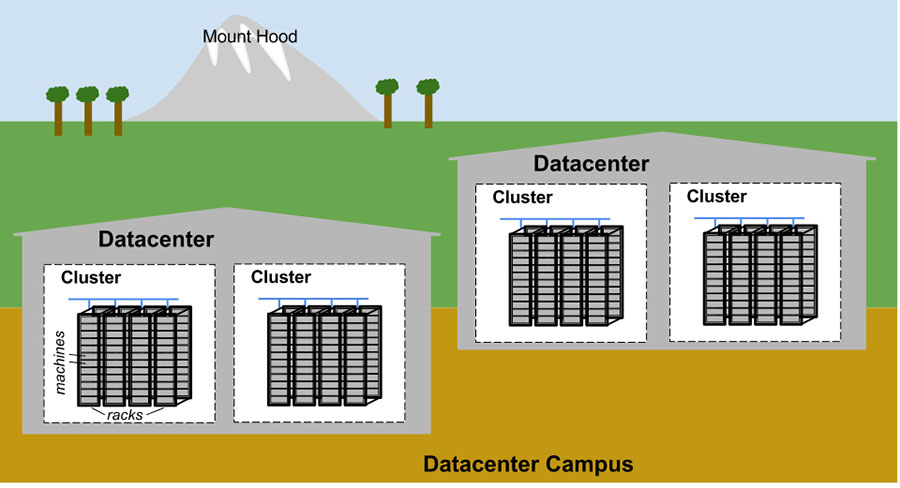
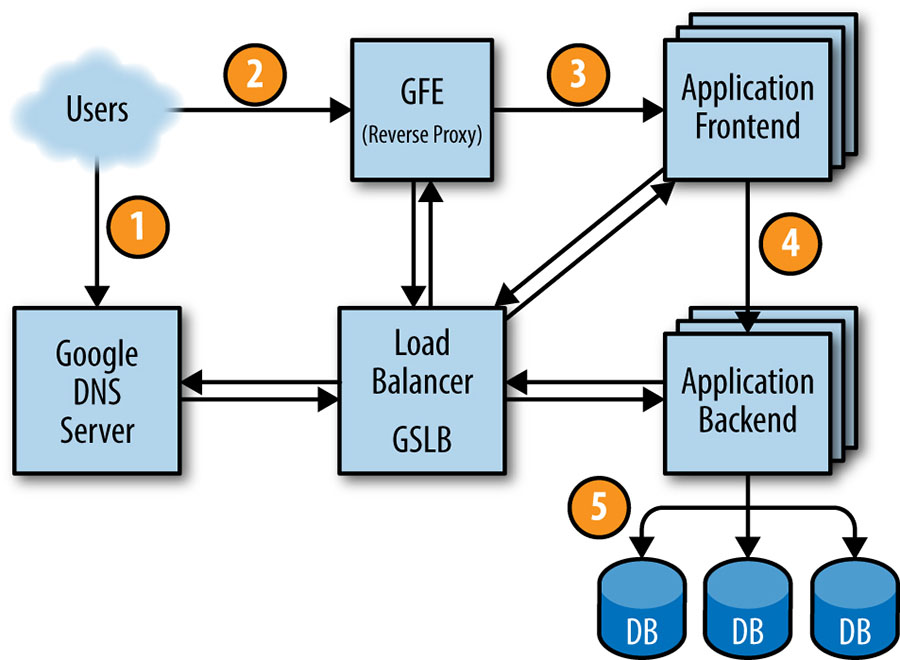

# 1장. 소개

## SRE가 무엇인가
### 전통적인 운영 조직 구조
- sysadmin
- 개발팀과 운영팀으로 나뉜 조직
### 문제점
- 직접 비용: 업무의 많은 부분이 수작업
- 간접 비용: 개발팀과의 커뮤니케이션, 서로 다른 용어, 서로 다른 목표(안전 지향)
### SRE
- 한 줄 요약: 운영팀을 위한 소프트웨어 엔지니어
- 2003년 구글에서 처음 출현
- 6:4비율의 개발자 대 시스템관리자 출신
### 구성원 특징
- 수작업을 금새 실증내는 사람들
- 수작업을 자동화한 소프트웨어 개발 역량을 갖춘 사람들
### SRE의 신조
#### 1.지속적으로 엔지니어링에 집중한다
- 끊임없는 엔지니어링: 문제를 발견하고 해결하고, 코드를 작성해야 한다.
- 운영업무에 최대 50%의 시간만 투입한다는 원칙.
- 반드시 포스트모텀을 작성함으로서 모니터링 되지 않은 부분의 개선, 비난보다는 실수를 공유
#### 2.서비스의 안정성을 유지하면서 변화를 최대한 수용한다.
- 에러 예산(Error Budget)
  - `모든 것에 대해 신뢰성 목표를 100%로 설정하는 것은 잘못된 목표설정이다.`
  - 가용성 100%와 99.999%로 유지 할 때의 미세한 차이는 대개 시스템 외부의 이슈로 인해 사라지고 만다.
  - 가용성의 나머지 만큼을 에러 예산으로 잡고 자유롭게 사용한다.
- 새로운 기능 출시 등의 변화를 도입시 에러 예산을 활용.
- 무정지 시스템의 목표를 세우지 않는다.
- 시스템이 정지하더라도 예측가능한 상황이 된다.
#### 3.모니터링
- 무분별한 알람 메일 대신, `장애에 관한 판단은 소프트웨어가 대신하고 반드시 어떤 대응이 필요한 경우에만 사람에게 알림이 도착해야한다.`
- 모니터링의 세가지 구분
  - 알림(alert): 사람이 즉각적으로 어떤 대응을 취해야 하는 것.
  - 티켓(tickets): 사람의 대응이 필요하지만 즉각적인 대응이 필요하지 않음.
  - 로깅(logging): 긴급한 상황이 생기기 전까지는 굳이 읽어볼 필요는 없는 것.
#### 4.긴급 대응
- 긴급대응의 효율을 나타내는 지표: 평균 수리 시간(Mean Time To Repair, MTTR)
- 시스템이 직접 처리하는 경우 대비 사람이 개입시 3배의 시간 소요
- 행동 지침에 따라 잘 훈련된 엔지니어가 일을 잘 수행해 냈다.
#### 5.변화 관리
- `70%는 시스템에 변화를 주다가 장애가 발생한다.`
- 해결책
  - 제품의 단계적 출시
  - 문제를 빠르고 정확하게 도출하기
  - 문제 발생시 안전하게 이전 버전으로 돌리기
#### 6.수요 예측과 수용 계획
- 자연적 성장과 인위적 성장 모두 고려
#### 7.프로비저닝
- 수요 예측에 따라 변화 관리를 위한 전략
- 미리 훈련이 필요
#### 8.효율성과 성능
- SRE와 제품 개발자는 서비스를 계속 모니터링하고 성능을 개선해서 수용력을 확보하고 효율성을 향상시켜야 한다.

# 2장. SRE 관점에서 바라본 구글의 프로덕션 환경

## 하드웨어
- 대부분이 구글이 직접 디자인한 동일한 하드웨어이다.
### 구글의 용어 정의
- 머신(machine): 하드웨어 또는 VM
- 서버(server): 서비스를 구현하는 소프트웨어
### 구글 데이터 센터 토폴로지

### 머신 관리
- 보그(Borg) ->  Kubernetes
  - 보그는 Job을 실행
  - Job은 서버, 배치, 또는 다른 Job의 묶음
  - IP 대신 보그 네임 서비스
  - 사용하는 리소스의 크기 명시
### 저장소
- HDFS
- 러스터(Lustre): 클러스터 파일 시스템
- 여러 계층으로 구성
### 네트워크
- 대역폭 할당기: 가용 대역폭 관리
- 글로벌 로드밸런서(GSLB)
  - DNS 요청에 대한 지역적 로드밸런싱 (www.google.com)
  - 사용자 서비스 수준에서의 로드밸런싱 (유튜브, 구글맵)
  - 원격 프로시저 호출 수준에서의 로드밸런싱 (20장)
### 개발환경
- 엔지니어들은 하나의 공유 저장소를 바탕으로 업무를 수행
  - 참고 : `The Motivation for a Monolithic Codebase: Why Google stores billions of lines of code in a single repository`
- 압묵적 합의
  - 프로젝트 외부에서 코드에서 문제가 발생하면 엔지니어는 문제를 해결하고 변경사항을 소유자에게 보내서 리뷰를 요청한후 커밋할 수 있다.
  - 모든 소프트웨어는 제출되기 전에 리뷰를 받아야 한다.
- CI
  - 변경사항 발생시 영향 받는 모든 소프트웨어에 대해 테스트가 수행된다.
  - 일부 프로젝트들은 테스트 통과시 자동 배포된다. (Push on Green)
## 셰익스피어: 예제 서비스

1. DNS query 단계에서 GSLB는 여러 서버간의 부하를 추적하므로 현재 사용자에게 적당한 서버의 IP 주소를 전달한다.
2. http 접속 
3. GFE는 GSLB의 도움을 받아 셰익스피어 프론트엔드 서버를 찾는다. (Service Discovery?)
4. 셰익스피어 프론트 서버는 자신이 연결할 백엔드 서버의 주소를 GSLB를 통해 얻는다.

# 참고자료: 구글이 단일 저장소를 쓰는 이유
- 2016년까지 86TB, 20억 라인의 코드가 단일 저장소에
- 장점
  - 단일 버전, 단순한 의존성 관리
  - Atomic changes
  - 대규모 리펙토링의 용이함
  - 매우 활발한 코드 공유, 재사용, 여러팀간의 쉬운 협업
  - 팀간의 코드 소유 및 경계가 매우 유연
  - 쉽게 눈에 들어오는 저장소 트리, 자연스럽게 팀공간이 구분됨
- 단점
  - 이를 관리하기 위해서는 많은 지원도구들이 필요하며, 대개 직접 개발. (여러 개발 툴 플러그인등, 자체적인 인덱싱 시스템, 이들의 지속적인 유지보수)
  - 코드베이스가 복잡해서 찾기가 어렵고(추가적인 툴 필요), 의존성 추가가 너무 쉬우므로 코드간에 불필요한 의존성이 생긴다.
  - 깔끔하게 유지하기 위한 노력이 필요하다.
- 구글 안드로이드 저장소는 Git을 쓰고 800개이상으로 쪼개져있다.
- 결론: 구글이니까 가능하다. 이미 단일 저장소를 유지하기 위해 엄청난 노력을 툴 개발에 쏟아왔고 많은 규칙과 문화들이 존재한다. 굳이 이 모든것을 버리고 DVCS로 넘어갈 이유는 없다.

# 3장. 위험 요소 수용하기

## 신뢰성 100%의 유지는 낭비다
- 신뢰성을 극대화하면 새로운 기능을 개발하는 속도나 사용자에게 제품을 출시하는 기간에 오히려 제동을 걸게된다.
- `신뢰성이 99%인 스마트폰을 사용하는 사용자는 서비스의 99.99% 신뢰성과 99.999% 신뢰성이 어떻게 다른지 판단할 수 없다.`
- 업타임의 극대화보다는 빠른 제품 개선과 효과적인 서비스 운영에 집중한다.
## 신뢰성 향상의 비용
- 약간의 신뢰성 향상에 100배의 비용이 증가하는 경우도 있다.
- 여분의 머신/컴퓨트 자원 비용
- 기회 비용: 위험 대비용 코드를 짜느라 신규 기능을 만들지 못한다.
## 서비스 위험 측정하기
- 의도되지 않은(unplanned) 다운타임을 얼마나 수용할 수 있는지에 초점을 맞춘다.
- 시간 기준 측정시 : 가용성 = 업타임 / (업타임 + 다운타임)
- 구글은 장애 분리(fault isonlation)을 채택하고 있으므로 전체 서비스가 다운되지 않는다. 따라서 시간 대신 `요청 성공률`을 사용한다.
- 요청 성공률: 가용성 = 성공한 요청 수 / 전체 요청 수
## 소비자 대상 서비스의 위험 수용도 정의하기
### 목표 가용성 수준을 결정할때 지표들
- 사용자들의 기대 수준
- 수익과 직접 연관 여부
- 유료/무료 서비스 여부
- 경쟁서비스의 가용성
- 사용자가 개인인지 기업인지
### 비용
- 구글 애드와 같이 서비스 가용성 변화에 따른 수익률 변화가 정확히 예측되는 경우 적절한 가용성을 계산할 수 있다.
- 대안: ISP들의 백그라운드 에러율을 고려한다. 
  - 해당 에러율보다 낮게 유지한다면 서비스의 에러는 묻힐 수 있다.
  - 구글이 측정한 ISP의 평균 백그라운드 에러율은 `0.01% ~ 1% 사이` 
## 인프라스트럭처 서비스의 위험 수용도 정의하기
- 예) 빅테이블
- 고객에 따라 처리량을 중시(오프라인 분석)하거나 신뢰성을 중시한다.
- 둘 다 최고수준을 유지하는것은 지나치게 많은 비용이 든다.
- 한 가지 솔루션은 두 가지 종류의 서비스를 제공하는 것이다.
- Google+
  - 민감한 데이터: 영구저장소, SQL
  - 그외의 데이터: NoSQL
## 에러 예산 활용하기
- 제품 개발 팀과 SRE간의 의견 충돌
- 개발 속도 vs 신뢰성
  - 소프트웨어 결함 허용
  - 테스트
  - 출시 빈도
  - 카나리 테스트 빈도와 규모
- 이러한 목표에 합의하기 위해 에러 예산을 설정한다.
### 에러 예산 산정
- 서비스 수준 목표(SLO)에 따라 분기별 에러 예산 산정
  - 실제 업타임 - 예상 업타임 = 에러 예산, 이 분기에 얼마만큼의 '불안정성을 허용할 것인가'
- 개발팀과 SRE는 이 값을 기반으로 서로 협의
  - ex)이번 분기 에러 예산이 이미 고갈되었으니 다음 분기에 출시하자.
- 만일 네트워크나 데이터센터에 장애가 발생해서 측정된 SLO 지표가 떨어졌다면?
  - 서비스 업타임의 책임은 팀원 모두가 공유해야 하므로 배포횟수가 감소되어야 한다.
- 팀이 새로운 기능을 출시하는데 어려움을 겪고 있다면 혁신을 위해 SLO를 희생하는 것도 내릴 수 있는 결정이다.
- 요약
  - `에러 예산은 SRE와 제품 개발팀 사이의 공동 소유권을 강조하며 각자의 역할을 명료하게 한다. 에러 예산은 새로운 기능의 릴리즈 비율을 결정하고, 장애와 관련된 의사 결정자들과의 불필요한 논쟁을 효과적으로 줄이며, 여러 팀이 서로에게 악감정을 갖지 않고도 제품에 대한 공통의 결론을 내리는 데 도움이 된다.`

# 4장. 서비스 수준 목표
## 용어
- 서비스 수준 **척도**(SLI)
  - 서비스 수준을 판단할 수 있는 정량적 값
  - ex) 응답속도, 에러율, 시스템 처리량(throughput), 가용성
- 서비스 수준 **목표**(SLO)
  - SLI에 의해 측정된 서비스 수준의 목표값
  - SLO를 설정함으로서 서비스의 동작에 대한 예측을 가능하게 한다.
  - 사용자들의 근거 없는 불평을 잠재우기
- 서비스 수준 **협약**(SLA)
  - SLO를 만족했을 때와 그렇지 못할때의 댓가에 대한 사용자와의 계약
  - "SLO를 만족하지 못하면 어떻게 될 것인가?"
  - 구글 검색은 중요한 서비스임에도 SLA가 존재하지 않는 좋은 예
  - 하지만 SLA가 없어도 SLI와 SLO를 설정하고 이를 토대로 관리
## 척도(SLI) 설정
### 시스템의 종류에 따라 다르게
- 사용자가 직접 대면하는 시스템: 가용성, 응답시간, 처리량
- 저장소 시스템: 응답시간, 가용성, 내구성
- 빅데이터 시스템: 처리량, 종단간 응답시간
### 고려할 점
- 측정 데이터의 정확성
- 지표의 평균보다는 분포가 중요하다.
- 응답시간의 변동이 큰 것보다 살짝 느린게 낫다
## 목표(SLO) 설정
- 목표를 먼저 설정하고 적절한 척도를 찾는게 낫다.
### 척도를 표준화하여 정의하기
- Get RPC 호출의 99%(1분간 평균)는 100밀리초 이내에 수행되어야 한다.(모든 백엔드 서버에서 측정된 평균 시간이어야 한다.)
- Get RPC 호출의 99%는 100밀리초 이내에 수행되어야 한다.
### 중요한 성능지표는 여러개를 설정 할 수도 있다.
- Get RPC 호출의 90%는 1밀리초 이내에 수행되어야 한다.
- Get RPC 호출의 99%는 10밀리초 이내에 수행되어야 한다.
- Get RPC 호출의 99.9%는 100밀리초 이내에 수행되어야 한다.
### 목표 선택에의 조언
- 목표를 100% 달성한다는 생각을 버리고 에러 예산(SLO를 만족하지 못하는 비율)을 사용하라.
- 적은 수의 SLO를 설정 할 것
- 처음엔 느슨한 목표를 설정후 강화하는게 낫다.
## SLA
- 사업팀과 법무팀에서
- 보수적으로
# 개인적으로 배운 것
- 에러 예산이라는 개념
- 간단하게 SLO를 설정하고 에러 예산을 설정해봐야겠다.
